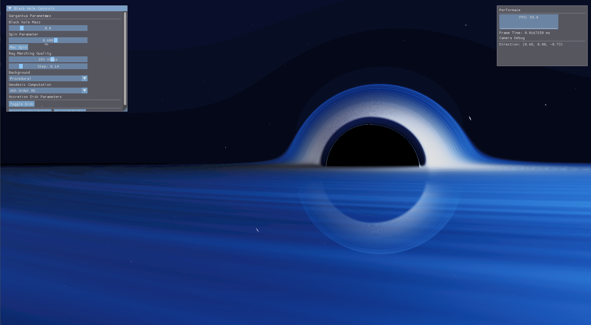

# Gargantua
### An attempt to render physically accurate black hole from the movie <em>Interstellar</em> in real time

## Thoughts about this Project
- Black holes are awesome.
- I just played the game Outer Wilds and I was curious how they integrated it into the game.
- Seemed like a good opportunity to teach myself compute pipelines, ray marching, and post processing.
- The post processing is not as prominent as I hoped to be. Will work on this when I come back to this project.
	- maybe will add extra layers of post processing (blur, vinegette, anti-aliasing and denoising comes to mind).
	- adding directional + point light would have helped, but didn't get to implement it
- The physics regarding the spinning black hole was very hard to understand (I had to use AI assistance for bits of phyics code)
- Volumetrics were challenging as well.
- Wrestled with Vulkan synchronization (Image Barriers in between compute passes), and walked out with a much better understanding of it.

## Rendering Techniques
- Ray Marching
- Volumetric clouds
- Post Processing (Bloom only)

## Technology used
- Vulkan API 1.4 (practially used 1.3 features only)
- Slang runtime compiler
- ImGui
- C++17

## References & Resources
- Gravitational Lensing by Spinning Black Holes in Astrophysics, and in the movie <em>Interstellar</em> *[Link](https://arxiv.org/abs/1502.03808)*
- Lets Reproduce Calculations from Interstellar - ScienceClic English Youtube - *[Link](https://www.youtube.com/watch?v=ABFGKdKKKyg&list=PLEPmoeZg7uNXDgLQvNT5zQreMmGu2gnHv&index=7&ab_channel=ScienceClicEnglish)*
- How I used Code to make a Black Hole - TheCodeStories Youtube - *[Link](https://www.youtube.com/watch?v=dMohMW29gSM&list=PLEPmoeZg7uNXDgLQvNT5zQreMmGu2gnHv&index=11&ab_channel=TheCodeStories)*